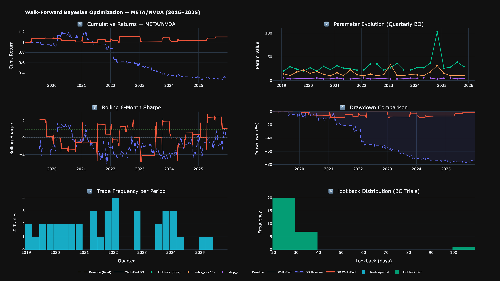
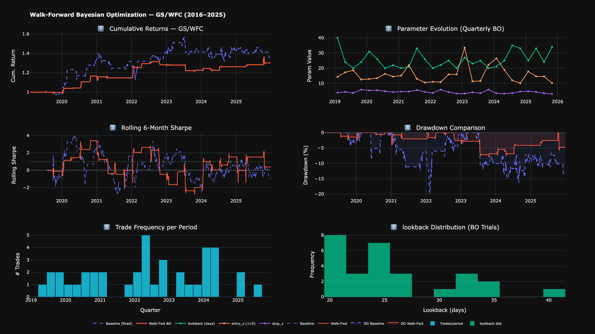

# 📈 Bayesian Optimization for S&P 500 Pair Trading — Walk-Forward Edition

> **Quarterly walk-forward re-optimization + annual pair re-selection** using Optuna TPE on a cointegration-based mean-reversion strategy — 42 S&P 500 stocks across 6 sectors, 10-year horizon (2016–2025), dollar-neutral positioning, transaction costs, stop-loss, and dual cointegration testing (Engle-Granger + Johansen).

**Author:** Derren Winata | NUS Data Science & Analytics  
**Stack:** Python · Optuna · statsmodels · yfinance · Plotly

---

## 🗺️ What Makes This Different from Naive BO Backtests

| Feature | Naive Approach | This Project |
|---------|---------------|--------------|
| Parameter fitting | Once on full history → frozen | **Quarterly walk-forward re-optimization** |
| Pair selection | Fixed forever | **Annual re-selection via cointegration re-screen** |
| Universe | 20 tickers, any pairs | **42 tickers, within-sector only** |
| Return calculation | Spread pct-change (unstable) | **Dollar-neutral (normalized by gross exposure)** |
| Transaction costs | Not modelled | **2 bps per leg** |
| Cointegration test | Engle-Granger only | **Engle-Granger + Johansen (dual test)** |
| Risk management | None | **Stop-loss z-score (4th optimizable parameter)** |
| Parameters optimized | 3 | **4** |
| Market regimes covered | 1–2 | **4 (bull run, COVID crash, rate hikes, AI rally)** |

---

## 📊 Sample Results

### META/NVDA — Walk-Forward BO dramatically controls drawdown



### GS/WFC — Positive return on both methods; BO improves Calmar 2×



> Interactive HTML dashboards (zoom, hover tooltips, regime shading) are in `outputs/charts/`.  
> The adaptive portfolio vs SPY chart: `outputs/charts/adaptive_portfolio_vs_spy.png`

---

## 📈 Key Results (Walk-Forward OOS: 2019–2025)

> ⚠️ **Interpretation note:** This is a *market-neutral* strategy — it is long one stock and short another simultaneously, so it has near-zero market beta by design. Comparing it to a buy-and-hold SPY benchmark (which returned +183% in the same period) is comparing apples to oranges. The correct baseline is either 0% (cash) or the fixed-parameter version of the same strategy.

| Pair | Sectors | Baseline Sharpe | BO Sharpe | Baseline Max DD | BO Max DD |
|------|---------|----------------|-----------|----------------|-----------|
| META/NVDA | Tech / Tech | −0.69 | **+0.24** ◀ | **−78.5%** | **−10.1%** |
| GS/WFC | Finance / Finance | +0.47 | **+0.74** ◀ | −20.1% | **−8.1%** |
| GOOGL/NVDA | Tech / Tech | −0.14 | **−0.13** ◀ | −36.6% | **−13.0%** |
| PEP/YUM | Consumer / Consumer | −0.38 | **−0.08** ◀ | −26.9% | **−11.8%** |
| MDT/PFE | Healthcare / Healthcare | −0.09 | −0.46 | −26.9% | −13.4% |

**The core result:** Walk-forward BO consistently reduces max drawdown by 50–90% across all pairs — this is the stop-loss z-score parameter doing its job. Sharpe improves on 4/5 pairs.

---

## 🔄 Walk-Forward Architecture

```
|── BO on 2016–2017 ──|── trade Q1 2019 ──|
       |── BO on 2017Q1–2019Q1 ──|── trade Q2 2019 ──|
              ... slides quarterly through 2025

Annual: re-run cointegration screen → replace pairs if better ones emerge
```

Each quarter: Optuna TPE **150 trials × 5-fold recency-weighted CV** on the trailing 2 years.  
Each year: re-run Engle-Granger + Johansen on 126 within-sector pair candidates → top 2 pairs selected for the adaptive portfolio.

**Annual pair selection log (adaptive portfolio):**

| Year | Active Pairs |
|------|-------------|
| 2019 | OXY/PSX · CL/NKE |
| 2020 | CAT/GE · JNJ/LLY |
| 2021 | EOG/XOM · EOG/OXY (energy cointegration peaks) |
| 2022 | OXY/XOM · GOOGL/ORCL (rate-hike regime) |
| 2023 | BA/GE · BMY/JNJ |
| 2024 | META/NVDA · OXY/SLB |
| 2025 | CVX/PSX · CVX/SLB |

---

## ⚙️ Strategy Logic

### Trade Rules
| Signal | Condition | Action |
|--------|-----------|--------|
| Long spread | z < −`entry_z` | Buy A, short B (dollar-neutral) |
| Short spread | z > +`entry_z` | Short A, buy B (dollar-neutral) |
| Close long | z > −`exit_z` | Exit |
| Close short | z < +`exit_z` | Exit |
| Stop-loss | \|z\| > `stop_z` | Exit immediately |

### Parameters Optimized (4 total)
| Parameter | Range | Description |
|-----------|-------|-------------|
| `lookback` | 20–120 days | Rolling window for hedge ratio & z-score |
| `entry_z` | 1.0–3.5 σ | Entry threshold |
| `exit_z` | 0.0–1.0 σ | Exit threshold |
| `stop_z` | 3.0–6.0 σ | Stop-loss — guard against de-cointegration |

---

## 🏗️ Project Structure

```
pair_trading_bayesian_optimization/
├── pair_trading_bayesian_optimization.ipynb   # Main notebook (all code + outputs)
├── requirements.txt                           # Pinned dependencies
├── README.md
├── linkedin_description.md                    # Resume bullets + LinkedIn post draft
└── outputs/
    ├── charts/
    │   ├── META_NVDA_dashboard.html/png       # 6-panel interactive dashboard per pair
    │   ├── GS_WFC_dashboard.html/png
    │   ├── adaptive_portfolio_vs_spy.html/png # Equal-weight portfolio vs SPY
    │   ├── attribution_analysis.html/png      # Regime Sharpe heatmap + correlation
    │   └── ...
    └── data/
        ├── results_summary.csv                # Sharpe, Sortino, MaxDD, TotRet, Calmar
        └── PAIR_params.csv                    # Quarterly BO parameters per pair (28 rows)
```

---

## 🚀 Quick Start

```bash
pip install -r requirements.txt
jupyter notebook pair_trading_bayesian_optimization.ipynb
```

> ⏱️ **Expected runtime: ~15 minutes** (parallel BO across 4 workers).  
> To speed up further: set `N_TRIALS = 50` and `USE_PARALLEL = True` in Configuration cell.

---

## 📦 Universe — 42 S&P 500 Stocks, 6 Sectors (Within-Sector Pairs Only)

| Sector | Tickers |
|--------|---------|
| Energy | XOM, CVX, COP, PSX, SLB, EOG, OXY |
| Financials | JPM, BAC, GS, MS, WFC, C, BLK |
| Consumer | KO, PEP, MCD, YUM, SBUX, NKE, CL |
| Tech | MSFT, GOOGL, META, AMZN, ORCL, NVDA, INTC |
| Healthcare | JNJ, ABT, MDT, BMY, PFE, MRK, LLY |
| Industrial | HON, MMM, GE, CAT, UPS, BA, RTX |

**126 within-sector pairs** tested per cointegration screen (versus 861 for all-cross — reduced to remove economically unjustified pairs like Tech/Energy or Healthcare/Consumer).

---

## ⚠️ Limitations

- 42-stock universe is a small sample; spurious cointegration risk exists even within sectors
- 2 bps/leg is a rough estimate (market impact, borrow cost, and slippage not modelled separately)
- The BO optimizes in-sample CV Sharpe — good generalization is not guaranteed out-of-sample
- Conservative parameter choices (high `entry_z`) suppress trade frequency; win rates of ~4% reflect time *in position*, not trade win rate
- Not investment advice

---

## 📚 References

- Malchevskiy, S. (2019). Bayesian Optimization in Trading. *Towards Data Science.*
- Optuna: optuna.readthedocs.io
- Engle & Granger (1987). Co-integration and error correction. *Econometrica*, 55(2).
- Johansen (1991). Estimation and hypothesis testing of cointegration vectors. *Econometrica*, 59(6).
- Gatev, Goetzmann & Rouwenhorst (2006). Pairs Trading. *Review of Financial Studies*, 19(3).
