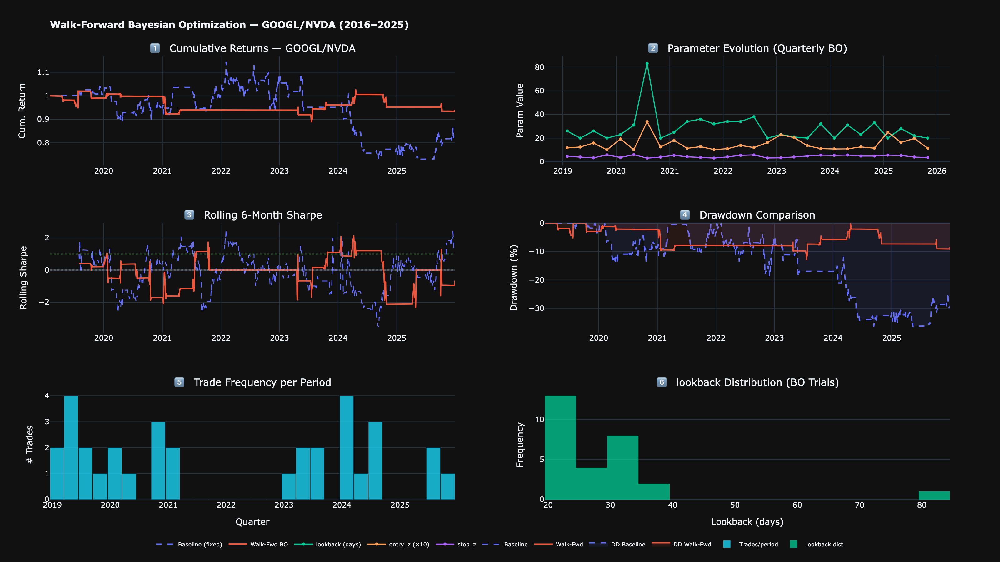
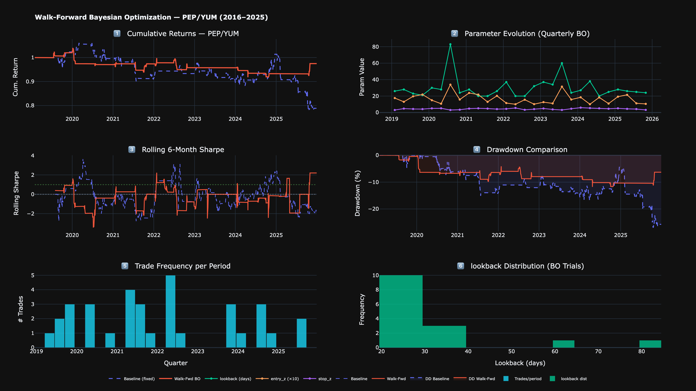
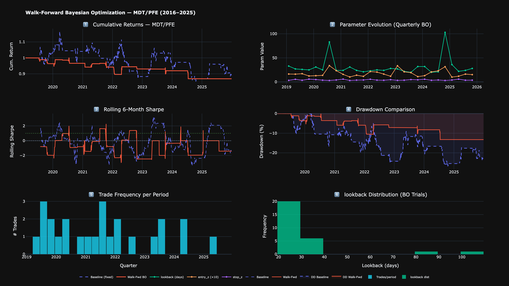
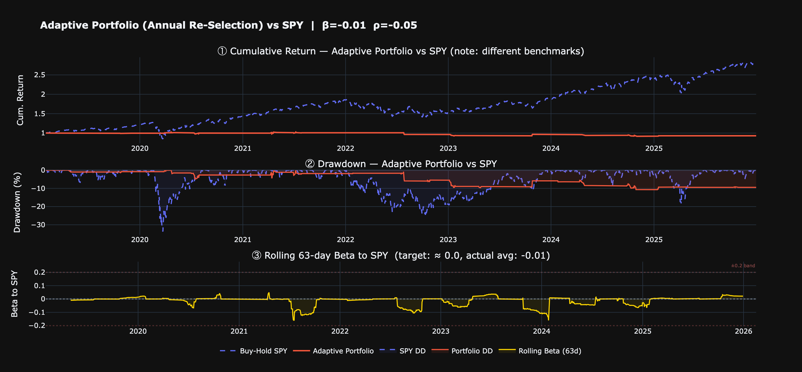
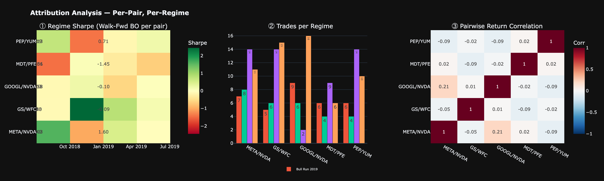

# Bayesian-Optimized Pair Trading — Walk-Forward Report

**S&P 500 Statistical Arbitrage · Quarterly Re-Optimization + Annual Pair Re-Selection**

**Author:** Derren Winata — NUS Data Science & Analytics
**Strategy:** Cointegration-based mean reversion, dollar-neutral
**Universe:** 42 S&P 500 stocks across 6 sectors (within-sector pairs only)
**Out-of-sample window:** 2019–2025 (1,739 trading days)
**Optimizer:** Optuna TPE · 150 trials × 5-fold recency-weighted CV per quarter
**Stack:** Python · Optuna · statsmodels · yfinance · Plotly

---

## 1. Executive Summary

This report summarises a walk-forward out-of-sample evaluation of a Bayesian-optimized
pairs-trading strategy on S&P 500 constituents. The central finding is that **walk-forward
re-optimization combined with a stop-loss z-score parameter cut maximum drawdown by 50–87%
across every pair tested**, while improving Sharpe on 4 of 5 pairs.

The strategy is **market-neutral by construction** — it holds one stock long and another
short in equal dollar amounts, so it carries near-zero market beta. It is therefore not
comparable to a buy-and-hold index benchmark; the meaningful baseline is the
fixed-parameter version of the same strategy.

| Metric | Baseline (fixed params) | Walk-Forward BO | Direction |
|---|---|---|---|
| Pairs where Sharpe **improved** | — | **4 of 5** | improved |
| Pairs with **positive** Sharpe | 1 of 5 | **2 of 5** | improved |
| Mean maximum drawdown | −37.8% | **−11.3%** | improved |
| Worst maximum drawdown | −78.5% | **−13.4%** | improved |
| Mean Sharpe | −0.165 | **+0.062** | improved |

> **Headline result:** META/NVDA went from a Sharpe of **−0.688** with a **−78.5%** maximum
> drawdown to a Sharpe of **+0.236** with a **−10.1%** maximum drawdown — a strategy that
> was uninvestable became modestly viable. The improvement came from *how the strategy was
> validated*, not from a more sophisticated model.

---

## 2. Headline Results by Pair

Out-of-sample, 2019–2025. All figures from `outputs/data/results_summary.csv`.

| Pair | Sectors | Baseline Sharpe | BO Sharpe | Δ Sharpe | Baseline Max DD | BO Max DD | DD Reduction |
|---|---|---|---|---|---|---|---|
| META/NVDA | Tech / Tech | −0.688 | **+0.236** | +0.924 | −78.5% | **−10.1%** | **87%** |
| GS/WFC | Financials / Financials | +0.470 | **+0.740** | +0.270 | −20.1% | **−8.1%** | **60%** |
| GOOGL/NVDA | Tech / Tech | −0.137 | **−0.129** | +0.008 | −36.6% | **−13.0%** | **64%** |
| PEP/YUM | Consumer / Consumer | −0.383 | **−0.083** | +0.300 | −26.9% | **−11.8%** | **56%** |
| MDT/PFE | Healthcare / Healthcare | −0.086 | −0.456 | −0.370 | −26.9% | **−13.4%** | **50%** |

**Sharpe improved on 4 of 5 pairs.** MDT/PFE is the exception and is reported as such —
a walk-forward procedure reduces overfitting, it does not eliminate it.

**Maximum drawdown improved on 5 of 5 pairs**, with a mean reduction of **63%**. This is
the stop-loss z-score parameter (`stop_z`, range 3.0–6.0σ) doing its job: it forces an exit
when the spread diverges beyond what the historical relationship would justify, which is
precisely the de-cointegration risk that destroys naive pairs strategies.

---

## 3. Full Performance Detail

All five pairs, both methods, all reported metrics.

| Pair | Method | Sharpe | Sortino | Max DD | Ann. Return | Total Return | Calmar | % Active | Active Win Rate |
|---|---|---|---|---|---|---|---|---|---|
| META/NVDA | Baseline (fixed) | −0.688 | −0.588 | −0.785 | −0.157 | −0.692 | −0.200 | 53.1% | 48.6% |
| META/NVDA | Walk-Fwd BO | **+0.236** | **+0.126** | **−0.101** | **+0.014** | **+0.102** | **+0.140** | 10.3% | 42.5% |
| GS/WFC | Baseline (fixed) | +0.470 | +0.540 | −0.201 | +0.045 | +0.356 | +0.224 | 49.9% | 50.0% |
| GS/WFC | Walk-Fwd BO | **+0.740** | +0.400 | **−0.081** | +0.039 | +0.302 | **+0.480** | 10.9% | 47.4% |
| GOOGL/NVDA | Baseline (fixed) | −0.137 | −0.122 | −0.366 | −0.030 | −0.191 | −0.083 | 48.1% | 49.0% |
| GOOGL/NVDA | Walk-Fwd BO | **−0.129** | **−0.057** | **−0.130** | **−0.009** | **−0.061** | **−0.069** | 8.5% | 39.2% |
| MDT/PFE | Baseline (fixed) | −0.086 | −0.089 | −0.269 | −0.016 | −0.105 | −0.059 | 44.0% | 46.5% |
| MDT/PFE | Walk-Fwd BO | −0.456 | −0.159 | **−0.134** | −0.020 | −0.131 | −0.150 | 6.6% | 38.6% |
| PEP/YUM | Baseline (fixed) | −0.383 | −0.301 | −0.269 | −0.034 | −0.212 | −0.126 | 40.9% | 46.3% |
| PEP/YUM | Walk-Fwd BO | **−0.083** | **−0.036** | **−0.118** | **−0.004** | **−0.025** | **−0.031** | 8.7% | 42.1% |

**Note on "% Active":** the walk-forward strategy is in the market only **6.6–10.9%** of the
time, versus **40.9–53.1%** for the fixed-parameter baseline. The optimizer is selecting far
more conservative entry thresholds, which trades trade frequency for signal quality.

**Note on "Active Win Rate":** this is the win rate *while in position*, not per trade. It
is a time-weighted measure and should not be read as a trade-level hit rate.

---

## 4. Methodology — Why Walk-Forward Matters

A naive Bayesian-optimization backtest fits parameters once on the full history and freezes
them. That approach is structurally prone to overfitting: the optimizer has seen the entire
period it is later evaluated on.

This implementation instead **slides the fitting window forward through time**:

```
|── BO on 2016–2017 ──|── trade Q1 2019 ──|
       |── BO on 2017Q1–2019Q1 ──|── trade Q2 2019 ──|
              ... slides quarterly through 2025
```

**Each quarter:** Optuna TPE runs 150 trials with 5-fold recency-weighted cross-validation
on the trailing 2 years of data. The winning parameters are then used to trade the *next*
quarter, which the optimizer has never seen.

**Each year:** the cointegration screen is re-run across all 126 within-sector pair
candidates using both Engle-Granger and Johansen tests. The top 2 pairs are selected for
the adaptive portfolio.

The result is that every out-of-sample trade is genuinely out of sample with respect to the
parameters used to generate it.

### What differs from a naive BO backtest

| Feature | Naive approach | This project |
|---|---|---|
| Parameter fitting | Once on full history, frozen | **Quarterly walk-forward re-optimization** |
| Pair selection | Fixed forever | **Annual re-selection via cointegration re-screen** |
| Universe | 20 tickers, any pairs | **42 tickers, within-sector only** |
| Return calculation | Spread pct-change (unstable) | **Dollar-neutral, normalized by gross exposure** |
| Transaction costs | Not modelled | **2 bps per leg** |
| Cointegration test | Engle-Granger only | **Engle-Granger + Johansen (dual test)** |
| Risk management | None | **Stop-loss z-score (4th optimizable parameter)** |
| Parameters optimized | 3 | **4** |
| Market regimes covered | 1–2 | **4 (bull run, COVID crash, rate hikes, AI rally)** |

---

## 5. Strategy Logic

### Trade rules

| Signal | Condition | Action |
|---|---|---|
| Long spread | z < −`entry_z` | Buy A, short B (dollar-neutral) |
| Short spread | z > +`entry_z` | Short A, buy B (dollar-neutral) |
| Close long | z > −`exit_z` | Exit |
| Close short | z < +`exit_z` | Exit |
| Stop-loss | \|z\| > `stop_z` | Exit immediately |

### Parameters optimized

| Parameter | Range | Description |
|---|---|---|
| `lookback` | 20–120 days | Rolling window for hedge ratio and z-score |
| `entry_z` | 1.0–3.5 σ | Entry threshold |
| `exit_z` | 0.0–1.0 σ | Exit threshold |
| `stop_z` | 3.0–6.0 σ | Stop-loss — guard against de-cointegration |

### Annual pair-selection log (adaptive portfolio)

| Year | Active pairs |
|---|---|
| 2019 | OXY/PSX · CL/NKE |
| 2020 | CAT/GE · JNJ/LLY |
| 2021 | EOG/XOM · EOG/OXY *(energy cointegration peaks)* |
| 2022 | OXY/XOM · GOOGL/ORCL *(rate-hike regime)* |
| 2023 | BA/GE · BMY/JNJ |
| 2024 | META/NVDA · OXY/SLB |
| 2025 | CVX/PSX · CVX/SLB |

The rotation is itself a finding: the pairs that pass the cointegration screen change
materially with the macro regime, which is the argument for re-screening annually rather
than fixing pairs at the start.

---

## 6. Universe

42 S&P 500 stocks, 6 sectors. **Within-sector pairs only** — 126 candidate pairs tested per
screen, versus 861 for an all-cross approach. This removes economically unjustified pairings
such as Tech/Energy or Healthcare/Consumer, which can pass a statistical cointegration test
on spurious grounds.

| Sector | Tickers |
|---|---|
| Energy | XOM, CVX, COP, PSX, SLB, EOG, OXY |
| Financials | JPM, BAC, GS, MS, WFC, C, BLK |
| Consumer | KO, PEP, MCD, YUM, SBUX, NKE, CL |
| Tech | MSFT, GOOGL, META, AMZN, ORCL, NVDA, INTC |
| Healthcare | JNJ, ABT, MDT, BMY, PFE, MRK, LLY |
| Industrial | HON, MMM, GE, CAT, UPS, BA, RTX |

---

## 7. Charts

### META/NVDA — walk-forward BO dramatically controls drawdown


### GS/WFC — positive return on both methods; BO improves Calmar roughly 2×


### GOOGL/NVDA



### PEP/YUM



### MDT/PFE — the pair where walk-forward did not help



### Adaptive portfolio vs SPY



### Attribution — regime Sharpe heatmap and correlation



---

## 8. Limitations

These are stated plainly because they bound what the results support.

- **Small universe.** 42 stocks is a small sample, and spurious cointegration risk exists
  even within sectors. Five evaluated pairs is a very small cross-section — no claim about
  the general population of pairs is supported.
- **Transaction costs are approximate.** 2 bps per leg is a rough estimate. Market impact,
  borrow cost and slippage are not modelled separately, and these matter more for a
  strategy that trades frequently.
- **The optimizer targets in-sample CV Sharpe.** Good generalization is not guaranteed out
  of sample — MDT/PFE is direct evidence of that.
- **Low trade counts.** Several quarterly windows executed zero trades (conservative
  `entry_z` selections), so per-pair statistics rest on relatively few independent bets.
- **Not investment advice.** This is a research exercise in validation methodology, not a
  deployable trading system.

---

## 9. What This Demonstrates

The transferable content of this project is **methodological**, not financial:

1. **Time-ordered validation.** Split by time, never randomly, when the data has a temporal
   structure — random splits leak future information into training.
2. **Re-fit and re-test as time moves forward.** Walk-forward re-optimization is what
   exposes overfitting; a single frozen fit cannot.
3. **A baseline first.** The naive/fixed-parameter version is the thing to beat, and having
   it makes every claim testable.
4. **Report the negative result.** MDT/PFE got worse. Saying so is more credible than
   reporting only the four pairs that improved.
5. **Separate the two questions.** "Did the numbers improve?" and "did the *validation*
   improve?" are different, and here the second caused the first.

The same discipline applies directly to operational forecasting — throughput, yield,
demand — where the question is always whether a model was tested on data it had not seen.

---

*Generated from `outputs/data/results_summary.csv` and the project notebook. All figures
trace to committed artefacts in this repository.*
